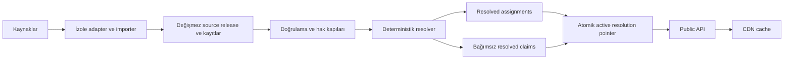

# macvendor.io — sürdürülebilir V1 mimarisi

Tarih: 11 Temmuz 2026
Durum: Bağlayıcı temel tasarım; çekirdek ve ölçüm temeli v0.0.10'da uygulanmıştır

## Ürün sınırı

macvendor.io bir cihaz tanıma servisi değildir. Bir EUI-48/MAC-48 girdisini kayıtlı adres bloğu atamalarıyla eşleştirir; resmî atama ile ürün sahibinin eklediği kürasyonlu iddiaları ayrı gösterir.

Şunlar garanti edilmez:

- fiziksel cihazın, kullanıcının, konumun veya ağın kimliği,
- registrant ile son ürün markasının aynı olduğu,
- yerel yönetilen bir MAC'in gerçek üreticiyi gösterdiği,
- amatör verinin resmî IEEE kaydı olduğu.

## Bağlayıcı belgeler

Bu genel belgenin ayrıntıları aşağıdaki sözleşmelerdedir. Çelişki halinde konuya özel belge geçerlidir.

- [`data-contract.md`](./data-contract.md): fiziksel V1 tabloları, normalizasyon, eşleştirme, zaman ve deterministik build.
- [`api-contract.md`](./api-contract.md): uçlar, yanıt ve hata şemaları, canonical URL ve uyumluluk.
- [`governance.md`](./governance.md): haklar, gizlilik, doğrulama, sunum ve düzeltme süreci.
- [`operations.md`](./operations.md): importer sınırları, roller, cache, rate limit, retention, RPO/RTO ve testler.
- [`action-register.md`](./action-register.md): tespit edilen 25 açığın karar ve uygulama karşılığı.
- [`audit-report.md`](./audit-report.md): sonraki tam denetimde bulunan kusurlar, onarımlar ve doğrulanamayan alanlar; normatif kurallar yukarıdaki konu belgelerindedir.

## Mimari karar

V1 düşük bağımlılıklı modüler monolittir:

- TypeScript uygulama ve worker kodu,
- PostgreSQL ana veri deposu,
- S3 uyumlu object storage ham artifact ve manifestler için,
- CDN/edge cache public GET trafiği için,
- tek deploy edilebilir uygulama; importer ve resolver ayrı komut/işlem olarak çalışır.

Redis, mesaj kuyruğu, arama motoru ve mikroservis V1'e alınmaz. Ölçülmüş bir darboğaz yokken bunlar operasyon yükü yaratır.

Çevrimdışı yol kaynak indirir, doğrular, normalize eder, çözümler ve yeni değişmez sürüm üretir. Çevrimiçi lookup hiçbir dış kaynağı çağırmaz; yalnız aktif sürümü okur. Bu ayrım bir kaynak kapandığında public API'nin çalışmaya devam etmesini sağlar.

## Kaynak sınıfları

| Sınıf | Kullanım | Resmî atamayı değiştirebilir mi? |
|---|---|---|
| `authoritative` | Resmî registry ataması | Resolver politikası içinde evet |
| `owner_curated` | Kullanıcının amatör/özel verisi | Hayır; ayrı claim üretir |
| `enrichment` | Alias ve yardımcı iddialar | Hayır; ayrı claim üretir |
| `reference` | QA ve karşılaştırma | Hayır |

Tek çalışma anahtarı `publish_mode` değeridir:

- `production`: hak ve doğrulama kapılarından sonra build girdisi,
- `qa_only`: karşılaştırma ve alarm,
- `disabled`: otomatik ingest ve resolver dışında.

Ayrı bir `enabled` alanı yoktur; iki bayrak çelişkili durum yaratır. Kaynağın indirilebilir olması production kullanım hakkı vermez.

Başlangıç yaklaşımı:

| Kaynak | Başlangıç rolü |
|---|---|
| IEEE Registration Authority MA-L/MA-M/MA-S | 2026-07-11 kanıt zinciri ve açık owner risk acceptance ile `authoritative/production`; direct-origin, imza, yıllık review ve yalnız `api_output` |
| KIT NETVS OUI lookup/verisi | `reference/qa_only`; availability veya kamuya açık oluşu yeniden dağıtım izni sayılmaz |
| Ringmast4r OUI Master ve benzeri derlemeler | Lisans ve satır kökeni çözülene kadar `reference/qa_only` |
| Eski Gist snapshot'ı | Güncellik ve haklar yetersizse `disabled` |
| Kullanıcının amatör veritabanları | Manifest ve satır kökeniyle `owner_curated`; varsayılan `qa_only` |

Veri modeli ileride amatör kaynakları 1–48 bit CIDR-benzeri ayrı iddialar
olarak taşıyabilir; `/48` exact cihaz kaydı sayılır ve varsayılan olarak public
değildir. Ancak amatör veri ingestion'ı açıkça ertelenmiştir ve mevcut sürümün
geliştirme ya da yayın kapsamına girmez. Keyfi aralık ve wildcard V1'e girmez.

## Resolver politikası

Resmî IEEE lookup sabit üç adayla longest-prefix match uygular:

1. 36 bit,
2. 28 bit,
3. 24 bit.

CID full-MAC lookup'a karıştırılmaz; exact assignment sorgusunda ayrı registry olarak ele alınır. Aynı prefix ve uzunlukta iki yetkili kaynak çelişirse sistem sessizce kazanan seçmez; release aktivasyonunu engeller.

Kürasyonlu claim'ler resmî sonucu ezmez. 1–48 bit için en fazla 48 aday sorgulanır ve en fazla 20 sonuç public yanıta girer. Aday sayısı protokol tarafından sınırlı olduğundan lookup pratikte sabit sayıda indeks erişimidir; PostgreSQL tarafında her erişim yaklaşık `O(log N)` olur.

## Fiziksel V1 kapsamı

V1'de gerçekten oluşturulacak tablolar:

1. `data_sources`
2. `source_releases`
3. `source_fetch_observations`
4. `source_artifacts`
5. `source_records`
6. `resolution_runs`
7. `resolution_inputs`
8. `resolved_assignments`
9. `resolved_claims`
10. `resolution_evidence`
11. `active_resolution`
12. `publication_suppressions`
13. `audit_events`

`organizations`, `organization_aliases`, kullanıcı hesabı, ödeme, API key ve vendor search tabloları V1'e dahil değildir. Vendor adı şu aşamada kaynak iddiasıdır; otomatik fuzzy birleştirme yapılmaz.

## Yayınlama ve geri alma

Her ingest ve resolution sonucu değişmez sürümdür. Build çıktısı; kaynak artifact hash'leri, adapter/normalizer/schema sürümleri, politika commit SHA'sı, container digest'i, locale ve zaman dilimi sabitlenerek deterministik üretilir.

Aktivasyon:

1. advisory lock alır,
2. `active_resolution` singleton satırını kilitler,
3. adayın doğrulanmış durumunu ve output hash'ini kontrol eder,
4. pointer ve artan `activeVersion` değerini tek transaction'da değiştirir,
5. transaction sonrası yeni sürüm cache anahtarlarına geçer; opsiyonel surrogate
   purge veya en geç beş dakikalık TTL eski cevabı kaldırır.

Rollback yeni veri yazmaz; pointer'ı önceki doğrulanmış sürüme aynı protokolle döndürür. Aynı input manifest ve politika aynı output hash'i üretmelidir.

## Dış API

V1'in üç public ucu vardır:

- `GET /v1/lookup/{mac}`
- `GET /v1/assignments/{registry}/{prefix}`
- `GET /v1/data-release`

Lookup yanıtı resmî `assignment` ile `curatedMatches` dizisini ayırır. Eşleşmesiz geçerli sorgu `200` ve `assignment: null` döndürür. Hatalar RFC 9457 problem JSON kullanır. Ayrıntılı şema ve cache davranışı `api-contract.md` içindedir.

## Güvenlik ve veri hakları

Production kaynak veya satır için en az şu kayıtlar bulunur:

- elde edilme biçimi ve zamanı,
- artifact ve manifest hash'i,
- hak dayanağı ve izin kapsamı,
- doğrulama durumu,
- inceleyen kişi ve değişmez audit olayı.

Hak kapsamı `internal_only`, `api_output` ve `raw_redistribution` olarak ayrılır. V1 ham veritabanı indirme sunmaz. Kaynağı belirsiz bir satır production'a giremez.

Exact `/48` kayıtlar ve 37–47 bit iddialar hassas kabul edilir. Kişi, konum, SSID ve gözlem zamanı public API'ye çıkmaz. Acil suppression aktif release yeniden build edilmeden public çıktıyı durdurabilir; kalıcı düzeltme yine yeni release ile yapılır.

## Operasyon hedefleri

- Availability SLO başlangıcı: aylık `%99.9` public lookup.
- Veri tazeliği: her kaynak için ayrı eşik ve alarm.
- PostgreSQL PITR: 7 gün.
- Konfigürasyon, hak ve suppression verisi RPO: 15 dakika.
- Yeniden üretilebilir kaynak/çözüm verisi RPO: 24 saat.
- Servis RTO: 4 saat.
- Üç aylık restore testi; altı aylık sıfırdan rebuild tatbikatı.

Trafik tahmini, hedef altyapı ve concurrency profili verilmediği için henüz
production gecikme SLO'su veya kapasite eşiği yoktur. Sentetik yerel baseline,
ölçüm yöntemi ve sınırları [`performance-benchmark.md`](./performance-benchmark.md)
ve [`performance-baseline.md`](./performance-baseline.md) içindedir. Rate limit
ancak deployment trafiği ölçüldükten sonra belirlenir; artifact/payload sınırları
`operations.md` içindedir.

## V1 dışı

- cihaz modeli, işletim sistemi, kullanıcı veya konum tespiti,
- EUI-64,
- bulk ham veri indirme,
- gelişmiş vendor katalog/search,
- kullanıcı hesabı, ödeme ve dashboard,
- otomatik fuzzy alias birleştirme,
- kaynakların public API lookup sırasında canlı çağrılması.

## Uygulama sırası

1. Hak matrisi, owner-curated manifest şeması ve ilk kaynakların production uygunluğu kesinleştirilir.
2. PostgreSQL migration'ları, check constraint'ler ve immutable release modeli kurulur.
3. Normalizer ve adapter sözleşmesi; property/fuzz testleriyle uygulanır.
4. Deterministik resolver, conflict kapıları ve active pointer transaction'ı uygulanır.
5. Public API, problem JSON, ETag, CDN ve rate limit uygulanır.
6. Düzeltme/suppression kanalı, audit, backup/restore ve gözlemlenebilirlik tamamlanır.
7. Yük, race, failure-injection ve sıfırdan rebuild testleri geçmeden production açılmaz.

## Production açılış kapıları

Şunlardan biri eksikse yayın yapılmaz:

- kullanılan her kaynak için belgelenmiş hak kapsamı,
- aynı prefix/uzunluktaki yetkili çelişkilerin sıfır olması,
- aynı manifestten aynı output hash üretme testi,
- migration rollback/forward ve eşzamanlı aktivasyon testi,
- cache purge arızası ve origin izolasyonu testi,
- restore ve sıfırdan rebuild kanıtı,
- çalışan düzeltme/takedown kanalı ve sorumlusu,
- kullanıcıya görünen kaynak, doğrulama ve disclaimer sayfaları.
